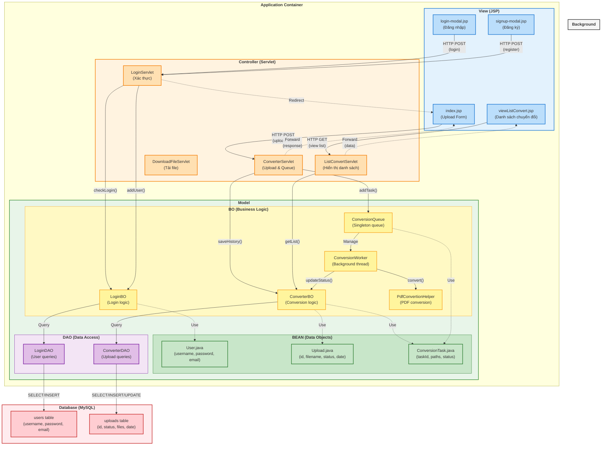

# Thiết kế Mô hình MVC - PDF Conversion System

## Sơ đồ Kiến trúc MVC



## Luồng xử lý chính

### 1. Luồng Upload File (Conversion Flow)
```
User (View) → index.jsp
    ↓ Submit form
ConverterServlet (Controller)
    ↓ Save file & create task
ConverterBO (Model - BO)
    ↓ Save to database
ConverterDAO (Model - DAO)
    ↓ INSERT query
Database (uploads table)
    ↓ Return upload ID
ConversionQueue (Model - BO)
    ↓ Add to queue
ConversionWorker (Background Thread)
    ↓ Process conversion
PdfConvertionHelper (Model - BO)
    ↓ Update status
ConverterDAO → Database
```

### 2. Luồng Xem Danh Sách (List View Flow)
```
User (View) → viewListConvert.jsp
    ↓ Request list
ListConvertServlet (Controller)
    ↓ Get username from session
ConverterBO (Model - BO)
    ↓ Query database
ConverterDAO (Model - DAO)
    ↓ SELECT query
Database (uploads table)
    ↓ Return list
ConverterDAO → ConverterBO → ListConvertServlet
    ↓ Forward with data
viewListConvert.jsp (View)
    ↓ Render list
User sees results
```

### 3. Luồng Đăng Nhập (Login Flow)
```
User (View) → login-modal.jsp
    ↓ Submit credentials
LoginServlet (Controller)
    ↓ Validate
LoginBO (Model - BO)
    ↓ Check credentials
LoginDAO (Model - DAO)
    ↓ SELECT query
Database (users table)
    ↓ Return user
LoginDAO → LoginBO → LoginServlet
    ↓ Create session & redirect
index.jsp (View)
```

## Chi tiết các thành phần

### VIEW Layer (Presentation)
- **index.jsp**: Trang chủ với form upload file PDF
- **viewListConvert.jsp**: Hiển thị danh sách file đã chuyển đổi
- **login-modal.jsp**: Modal đăng nhập
- **signup-modal.jsp**: Modal đăng ký tài khoản
- **header.jsp**: Header chung cho các trang

### CONTROLLER Layer (Request Handling)
- **ConverterServlet**: Xử lý upload file và thêm vào queue
- **ListConvertServlet**: Lấy và hiển thị danh sách chuyển đổi
- **LoginServlet**: Xử lý đăng nhập/đăng ký
- **DownloadFileServlet**: Xử lý download file DOCX

### MODEL Layer (Business Logic & Data)

#### BEAN (Data Transfer Objects)
- **User.java**: Đối tượng người dùng
  - username: String
  - password: String
  - email: String

- **Upload.java**: Đối tượng lịch sử chuyển đổi
  - id: int
  - username: String
  - fileNameUpload: String
  - fileNameOutput: String
  - status: String (queued/processing/completed/failed)
  - date: Timestamp

- **ConversionTask.java**: Đối tượng task trong queue
  - taskId: int
  - username: String
  - inputFilePath: String
  - outputFilePath: String

#### BO (Business Objects)
- **LoginBO**: Logic nghiệp vụ đăng nhập/đăng ký
- **ConverterBO**: Logic nghiệp vụ chuyển đổi file
- **ConversionQueue**: Quản lý hàng đợi (Singleton pattern)
- **ConversionWorker**: Thread xử lý conversion nền
- **PdfConvertionHelper**: Helper chuyển đổi PDF sang DOCX

#### DAO (Data Access Objects)
- **LoginDAO**: Truy vấn database cho user
  - checkLogin()
  - addUser()
  
- **ConverterDAO**: Truy vấn database cho uploads
  - saveHistory()
  - getListFileConvert()
  - updateStatus()

### DATABASE Layer
- **users table**: Lưu thông tin người dùng
- **uploads table**: Lưu lịch sử chuyển đổi

## Các Pattern được sử dụng

1. **MVC Pattern**: Tách biệt View, Controller, Model
2. **Singleton Pattern**: ConversionQueue
3. **DAO Pattern**: Tách biệt logic truy cập database
4. **Producer-Consumer Pattern**: ConversionQueue + ConversionWorker
5. **Thread Pool Pattern**: Background worker thread

## Đặc điểm kiến trúc

✅ **Tách biệt rõ ràng**: View - Controller - Model
✅ **Xử lý bất đồng bộ**: Queue-based processing
✅ **Thread-safe**: Sử dụng BlockingQueue và AtomicInteger
✅ **Scalable**: Có thể mở rộng thêm worker threads
✅ **Maintainable**: Dễ bảo trì và nâng cấp
